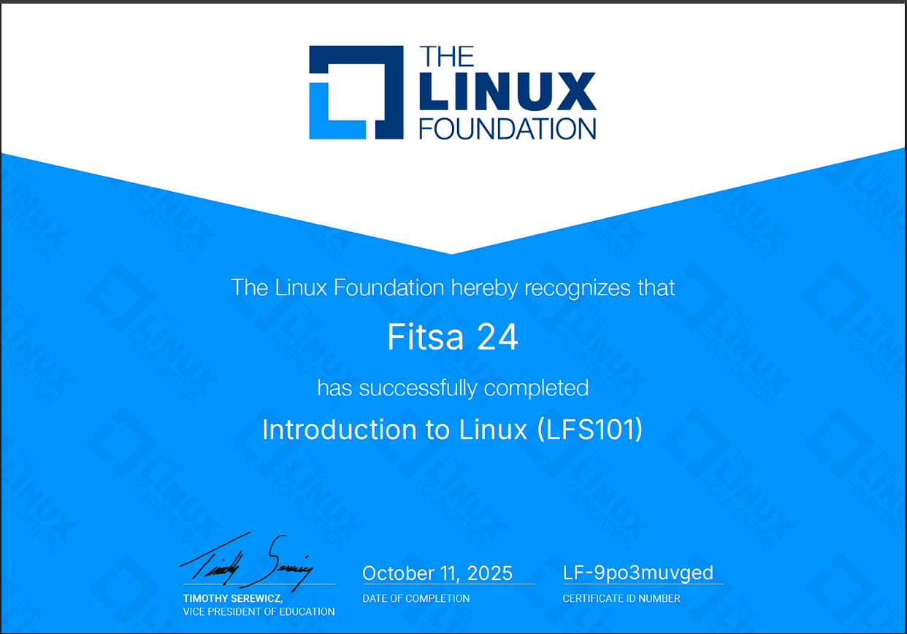
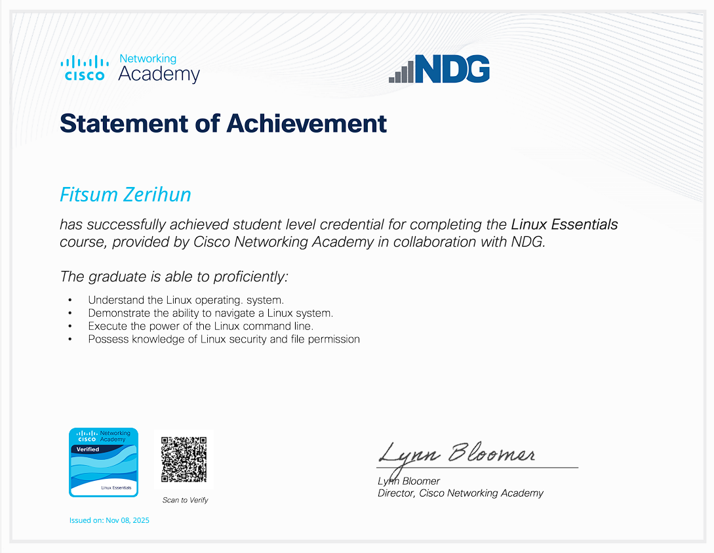
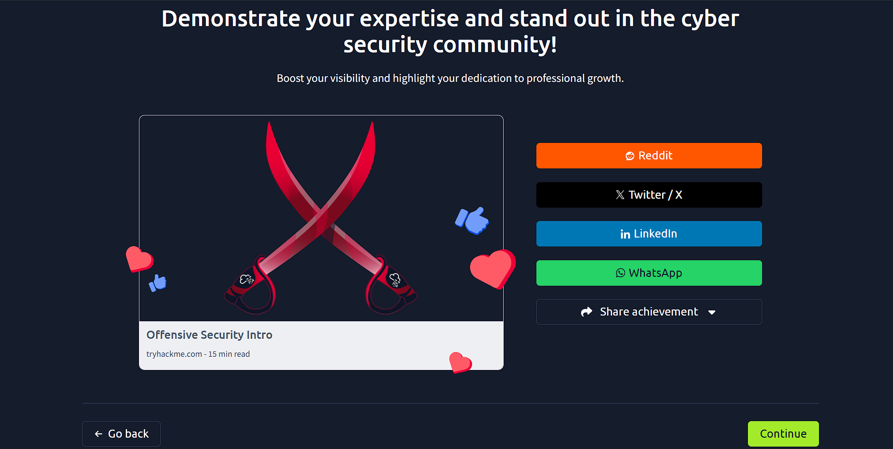
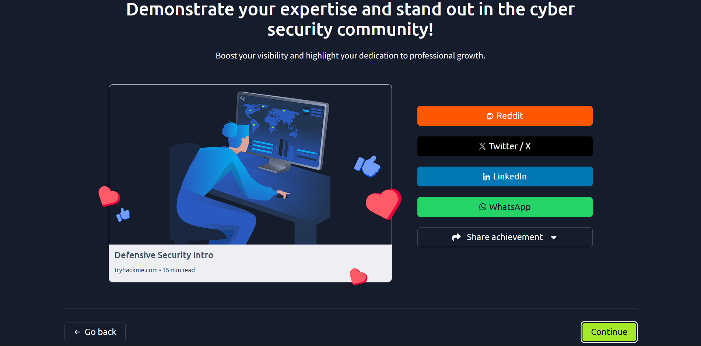

# 🔐 Foundational Risk Management & Secure Software Development


---

## 📖 Overview

This project combines **foundational risk management**, **secure software development**, and **cybersecurity essentials**. It’s designed for developers and cybersecurity enthusiasts looking to **build secure software**, **assess risks**, and **mitigate threats** effectively.

---

## 🛠 Skills & Tools

* **Secure Software Development:** Secure coding practices, input validation, authentication, encryption, secure APIs
* **Cybersecurity & Risk Management:** Threat modeling, vulnerability analysis, risk assessment
* **Courses & Digital Badges Completed:**

[](https://www.credly.com/badges/9e896d25-b10d-44b2-b510-22adc0a3440c/)



[](https://www.credly.com/badges/c6f2f53b-5312-42e0-9fdf-bb04135ecd7f/public_url)




* **Frameworks & Standards:** NIST RMF, ISO 27001
* **Soft Skills:** Security documentation, reporting, and secure coding best practices


[](https://www.credly.com/badges/46c560b7-4997-4bef-a1df-94921b89efe2)



[](https://www.credly.com/badges/46c560b7-4997-4bef-a1df-94921b89efe2)



---

## 📌 Features

* ✅ Secure software development practices integrated with risk management
* ✅ Asset identification and classification
* ✅ Threat modeling and vulnerability mapping
* ✅ Impact and likelihood scoring (CIA triad weighted)
* ✅ Risk level calculation and prioritization
* ✅ Templates and documentation for professional risk management

---

## 📈 Learning Outcomes

After completing this project, you will be able to:

1. Develop **secure software** that minimizes vulnerabilities and protects sensitive data
2. Identify critical assets and potential threats in a system
3. Evaluate vulnerabilities and calculate risk levels
4. Apply the **CIA triad** to assess the impact of risks
5. Apply principles from **cybersecurity essentials** to protect systems
6. Document and communicate risks and mitigation strategies professionally

---

## 📁 Folder Structure (Example)

```
Secure-Risk-Management/
│
├── docs/                  # Risk assessment templates and worksheets
├── examples/              # Example risk matrices and CIA triad scoring
├── secure_code/           # Secure software practices and code examples
├── README.md              # Project overview and instructions
└── LICENSE                # Creative Commons / course license
```

---

## 🧩 How to Use

1. **Clone the repo:**

   ```bash
   git clone https://github.com/CodeWithfitse/Secure-Risk-Management.git
   ```
2. Review **examples/** for sample risk assessments.
3. Check **secure_code/** for **secure software development examples**.
4. Apply **templates in docs/** to your own network, project, or software.
5. Use the README as a guide to calculate risk levels, apply mitigation, and develop secure software.

---

## 🏆 Achievements & Digital Badges

* [](https://www.credly.com/badges/9e896d25-b10d-44b2-b510-22adc0a3440c) – 100% COMPLETE
* [](https://www.credly.com/badges/46c560b7-4997-4bef-a1df-94921b89efe2)
* Applied **secure software development principles** in projects
* Developed **documentation templates** for repeatable risk assessments

---

## ⚡ Contribution

This project is educational and open-source friendly. Contributions are welcome if you want to:

* Add **new secure coding examples**
* Include **advanced threat scenarios**
* Improve documentation or templates

---

## 📄 License

This project is licensed under **[Creative Commons Attribution 4.0](https://creativecommons.org/licenses/by/4.0/)** — free to use and adapt with proper attribution.

---
